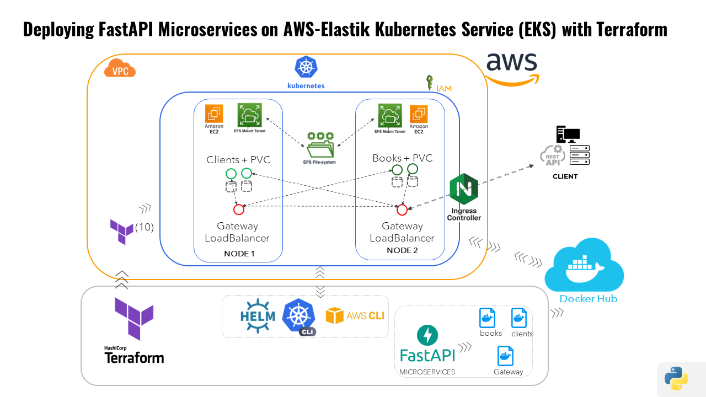

# Deploying FastAPI Microservices on AWS Elastic Kubernetes Service (EKS) using Terraform

This repository contains all necessary configurations and guidelines for deploying a bookstore application built with FastAPI on AWS Elastic Kubernetes Service (EKS) using Terraform. This project demonstrates setting up a robust Kubernetes cluster and deploying microservices that manage books and client data, utilizing an API Gateway for seamless service interaction.


## Prerequisites

Before you start, make sure you have installed and configured the following tools:

- [AWS CLI](https://aws.amazon.com/cli/) - Command-line tool for managing AWS resources.
- [Visual Studio Code](https://code.visualstudio.com/download) or [PyCharm](https://www.jetbrains.com/pycharm/download/) with the Terraform extension.
- [Terraform CLI](https://www.terraform.io/downloads.html) - Installed and added to your system's PATH.
- [Kubectl](https://kubernetes.io/docs/tasks/tools/) - Kubernetes command-line tool, also added to your system's PATH.
- An AWS account with an active subscription / Free tier.

## Repository Structure

- `TerraformScriptsEKS`: Contains Terraform scripts for provisioning the EKS cluster.
- `FastAPIApps`: Contains the FastAPI applications along with Dockerfiles and `requirements.txt` for each microservice.
- `assets`: This folder contains a complete list of commands used (`commands.txt`) and a PDF with step-by-step screenshots detailing the entire process.
- `deployments`: Kubernetes YAML configurations for deploying the microservices.

## Project Setup

### Step 1: Terraform Setup for EKS

1. **Environment Setup:**
   - Install all required tools and ensure they are correctly configured in your system's PATH.

2. **Terraform Initialization and Application:**
   - Navigate to the `TerraformScriptsEKS` directory.
   - Initialize Terraform:
     ```bash
     terraform init -upgrade
     ```
   - Create an execution plan:
     ```bash
     terraform plan -out main.tfplan
     ```
   - Apply the configuration to provision the EKS cluster:
     ```bash
     terraform apply main.tfplan
     ```

3. **Connect to the EKS Cluster:**
   - Update kubeconfig to interact with your cluster:
     ```bash
     aws eks --region us-west-2 update-kubeconfig --name <cluster-name>
     ```

### Step 2: FastAPI Microservices Development

1. **Build and Push Docker Images:**
   - Navigate to each FastAPI application directory.
   - Build and push the Docker images:
     ```bash
     docker build . -t <your-dockerhub-username>/<app-name>:<tag> .
     docker push <your-dockerhub-username>/<app-name>:<tag>
     ```

2. **Deploy Microservices:**
   - Apply the Kubernetes deployment and PVC configurations:
     ```bash
     kubectl apply -f books-data-pvc.yml
     kubectl apply -f books-deployment.yml
     kubectl apply -f clients-data-pvc.yml
     kubectl apply -f clients-deployment.yml
     ```

### Step 3: ConfigMap Configuration

1. **Setup ConfigMaps:**
   - Create a directory for configuration files:
     ```powershell
     New-Item -ItemType Directory -Path .\gateway-conf
     ```
   - Copy the configuration file into the new directory:
     ```powershell
     Copy-Item -Path .\gateway\app\conf.d\main.yml -Destination .\gateway-conf\
     ```
   - Create a ConfigMap and deploy the gateway:
     ```bash
     kubectl create cm books-gateway-conf --from-file gateway-conf/
     kubectl create -f gateway-deployment.yml
     ```

### Step 4: Service Exposure and Load Balancing

1. **Internal Exposure Using ClusterIP:**
   - Expose each microservice internally:
     ```bash
     kubectl expose deploy books-api --port=8000
     kubectl expose deploy clients-api --port=8000
     ```

2. **External Exposure Using LoadBalancer:**
   - Provide external access through a LoadBalancer:
     ```bash
     kubectl expose deploy gateway-api --port=8000 --type=LoadBalancer
     ```
   - Access the services externally using the provided IP:
     ```
     http://<external-ip>:8000/docs
     ```

### Step 5: Implementing NGINX Ingress Controller and Ingress Rules

- **Installing NGINX Ingress Controller**
  - Using Helm to install:
    ```bash
    helm install my-nginx bitnami/nginx-ingress-controller --set rbac.create=true
    ```

- **Configuring and Applying Ingress Rules**
  - Apply limits to prevent abuse:
    ```bash
    kubectl apply -f ingress-limiter.yml
    ```

- **Monitoring and Troubleshooting**
  - Commands to monitor and troubleshoot ingress setup:
    ```bash
    kubectl get ingress
    kubectl logs -n <namespace> -l app=nginx-ingress --tail=100
    ```

## Additional Resources

- For a complete list of commands used and step-by-step guidance, check the `assets` folder where you can find the `commands.txt` and a detailed PDF.

